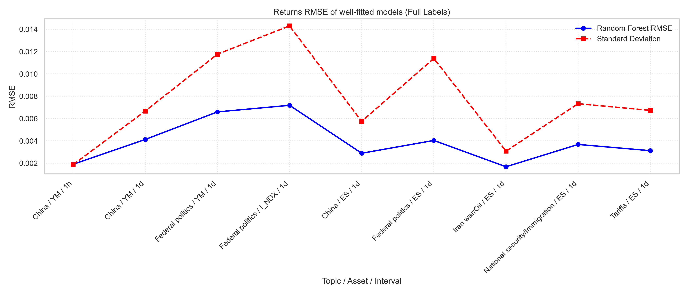
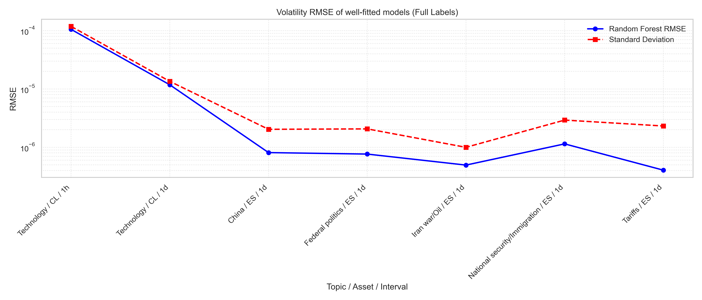
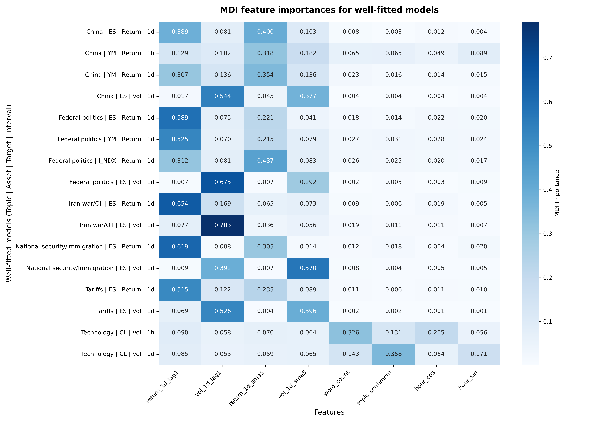
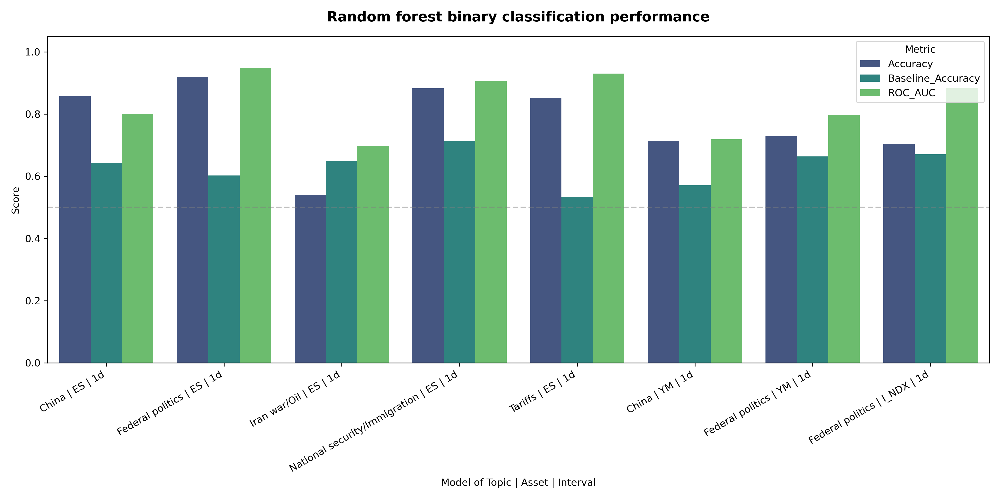
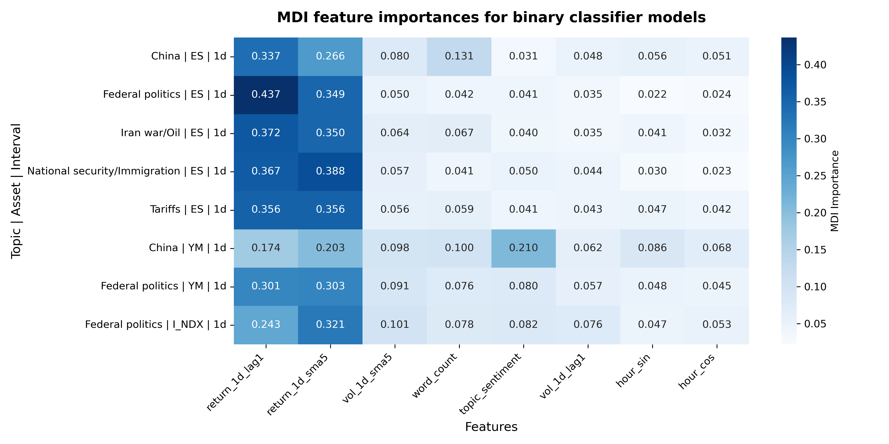
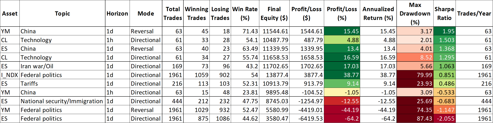
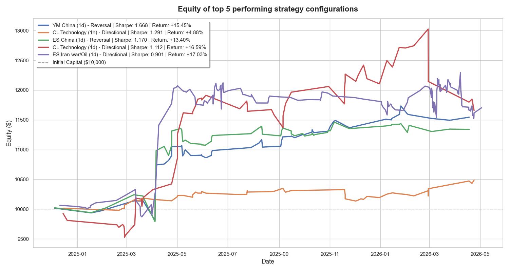

# Overview
In this project, a quantitative analysis of market reactions to Trump's social media events reveals that market performance is significantly correlated with the sentiment score of Trump's posts. Hence, a trading strategy is developed to execute trades based on the sentiment scores in Trump's posts. The results of our backtests support the profitability of our trading strategy.

# Table of Contents
- 📗[Data Source](#data-source)
- 🫕[Method](#method)
- 📈[Results](#results)
- 💻[Reproduce the analysis](#reproduce-the-analysis) 
- 📁[Project structure](#project-structure)
- 🔮[Future work](#future-work)
- 🏅[Acknowledgements](#acknowledgements)

# Data Source
**Social media text posts** by Donald Trump (@realDonaldTrump) on Truth Social during his second term were obtained from the [American Presidency Project archive](https://www.presidency.ucsb.edu/). The timeframe of the posts range from 1 Dec 2024 to present. 

**Financial data** obtained from [Massive API](https://massive.com/). Open, High, Low, Close, and Volume (OHLCV) values at frequencies of 1-min and 1-day were recorded. 15-min, 30-min, and 1-hr data were intrapolated from the 1-min data. The assets on which we focused our analysis were:

*Stock indices*
- NDX: NASDAQ 100 index

*Cryptocurrency*
- BTCUSD: Bitcoin

*Futures*
- CL: Crude Oil
- ZN: 10-Year US Treasury Note
- ES: E-mini S&P 500
- YM: E-mini Dow Jones Industrial Average

# Method
**Beta:** ES was used as the benchmark. 

**Topic classification of posts:** Six topics that are likely to impact the market were found manually: "China", "Federal politics", "Iran war/Oil", "National security/Immigration", "Tariffs", and "Technology". Topics are inspired by [the White House priorities](https://www.whitehouse.gov/priorities/) and mainstream news coverage of the 2nd Trump presidency. Non-text posts and posts which were deemed to have negligible effect on the market were classified as "Miscellaneous". Posts were classified into their respective topics by the presence of keywords within the post. These keywords were manually chosen. 

**Sentiment scores:** Generated by VADER Natural Language Processing (NLP) model. Sentiment scores take on continuous values ranging from -1 (negative sentiment) to 1 (positive sentiment). A score of 0 means that the post's sentiment is detected as neutral.

**Market-based features:** 1-day lagged and 5-period simple moving average (SMA) of 1-day ES returns and volatility. These features are implemented as a control to demonstrate the strength of correlation between Trump's posts and the predicted market performance. 

**Prediction of returns, volatility, and beta:** A random forest regression model is trained for each topic, with only the posts and financial data classified under that topic. The output is a 90-component vector for 6 assets, 5 intervals, and 3 target variables (returns, volatility, and beta). Features are: 
1. `word_count`
2. `hour_sin`: y-coordinate of a unit circle
3. `hour_cos`: x-coordinate of a unit circle
4. `return_1d_lag1`: 1-day lagged ES return
5. `vol_1d_lag1`: 1-day lagged ES volatility
6. `return_1d_sma5`: Rolling 5-period SMA of ES 1-day returns
7. `vol_1d_sma5`: Rolling 5-period SMA of ES 1-day volatility
8. `topic_*_sentiment`: Product of sentiment score and one-hot encoded topic classification. Asterisk * refers to the name of the topic.

**Prediction of direction of returns:** Utilizing the same data and features, we again use the random forest model to predict the direction of returns.

**Backtesting:** Our trading strategy is parameterized by:
- **Initial Capital**: $10,000.00
- **Transaction Costs**: 5.0 basis points (0.05%) per trade
- **Sentiment Entry Threshold**: $\pm 0.05$
- **Holding Horizons**: 1-hour or 1-day, up to user.
- **Trading Modes**:
  - **Directional**: Long on positive sentiment, Short on negative sentiment.
  - **Reversal**: Short on positive sentiment, Long on negative sentiment.

To assess the effectiveness and risk of our strategy, we compute the profit/loss percentage, maxinum drawdown, and Sharpe ratio. 

# Results
### Predictive accuracy of regression model
The accuracy of the random forest regression model at predicting returns, volatility, and beta were measured by computing the coefficient of determination $R^2$ and root-mean-squared error (RMSE). 

"Good" $R^2$ scores, defined as $R^2\geq0.5$, were found for the following configurations. Such high $R^2$ values signal strong correlations between the sentiment score of Trump's posts belonging to the specific topic and the price of the specific asset. This means that the selected features and models are suitable for predicting data for these configurations. $R^2$ were "poor" (ie. $R^2<0.5$) for all beta data. 
|Topic           | Asset| Interval   | Target variable|
| -------------- | ---- | ---------- |--------------- |
|Technology      | CL   | 1-hr, 1-day| Volatility     |
|China, Federal politics, Iran war/Oil, National security/Immigration, Tariffs| ES | 1-day | Returns, Volatility|
|China           | YM   | 1-hr, 1-day| Returns        |
|Federal politics| YM   | 1-day      | Returns        |
|Federal politics| I_NDX| 1-day      | Returns        |

Plots of the $R^2$ of all the topic-centred models across assets, intervals, and target variables are kept in `model_training.ipynb`.

Below are the plots of the returns and volatility RMSE of the "good" configurations, represented by the blue solid line. The standard deviations of the respective input data are marked by the red dotted line. We observe that the RMSE are consistently of the same scale or smaller compared to the standard deviations, suggesting high predictive accuracy of the random forest regression model on the "good" configurations. 




Since we have found certain configurations on which the random forest regression models produce accurate predictions of returns and volatility, we can investigate the relative contribution of each feature to the model's predictions using these same configurations, to understand the extent of influence of Trump's posts on the market's performance. 

### Feature importance of regression model
Mean Decrease Impurity (MDI) was used to measure feature importance. MDI quantifies the contributions of each feature to the total loss reduction of a Random Forest model. We focus on `topic_sentiment`. This feature exhibits MDIs of at least 1% for a majority of the well-fitted models, which is significant for the short timeframe of the change in the asset's price of at most 1 day. 


### Predictive accuracy of binary classification model
We measure the predictive accuracy of the random forest classification model at predicting the direction of returns, ie. whether the asset price will rise or fall, by computing the absolute accuracy, baseline accuracy, and area under the Receiver's Operating Characteristic curve (ROC AUC). Baseline accuracy is the proportion of the majority class in the test set, before model fitting. In all cases except for Iran war/Oil | ES | 1d, the absolute accuracy improved compared to the baseline accuracy and scores highly (>70%).  ROC AUC are all well above 0.5, meaning that the models perform better than random classification, where ROC AUC = 0.5. Hence, the selected features and the random forest classification models are suitable for predicting the direction of returns.


### Feature importance of binary classification model
`topic_sentiment` shows greater feature importance for most binary classification model than in the regression models, with the smallest feature importance across all "good" configurations being 3.1%. This indicates that after Trump's posts are published, their sentiment scores have significant correlations with the direction of the market.


### Backtesting
Considering the sizable impact that `topic_sentiment` on Trump's posts has on the value and direction of returns, we can build a trading strategy based on the sentiment score of his posts. We backtest the strategy on the configurations that exhibited "good" $R^2$ scores because the models generally had good accuracy in anticipating the values and directions of returns. If the sentiment score of Trump's post exceeded the threshold, the backtesting algorithm would take on either a long or short position depending on the trading mode chosen by the user. Should the sentiment score be within the threshold, the algorithm takes a hold position.

The better-performing trading mode for each configuration and the corresponding performance metric of our strategy is detailed in the below table. There are a number of profitable strategies found.



The equity growth of the 5 configurations with the highest Sharpe ratio over the timeframe of all available financial data are plotted below. 



*YM China (1d)* is the only equity curve out of the five that consistently and steadily rises. This suggests that the risk on this trading strategy is well-controlled for various market regimes.👍

# Reproduce the analysis
### Prerequisites:
- Python
- pip package manager

### Instructions:
1. Open a terminal.

2. Clone the git repository.
```
git clone https://github.com/lim-li-xuan-phy/trump-market-analysis.git
```

**Data collection**

3. Navigate to the downloaded repository.
```
cd trump-market-analysis
```

4. Create an account on Massive.com and get your API key. Open `download_market_data.py` in a text editor and set `MASSIVE_API_KEY` to your key.

5. Create virtual environment.
```
python -m venv venv
```

6. Activate virtual environment
```
# Windows
venv\Scripts\activate
# MacOS/Linux
source venv/bin/activate
```

7. Install dependencies
```
pip install -r Deployment/requirements.txt
cd src/python
```

8. Scrape all of Trump's Truth Social text posts from the archive and saved into the file `trump_posts.py`.
```
python scrape_posts.py
```

9. Download the financial data corresponding to the time range of the posts. If your Massive account is on the free tier, it will take approximately 1 day to download all available financial data.
```
python download_market_data.py
```
You have downloaded all the raw data to be used in your analysis. Next, we process the raw data for event study.

**Event study**

10. Navigate to the folder containing the C++ programs.
```
cd ../cpp
```
11. Compile all C++ programs. This will create an EXE file of each C++ program.
```
.\compile.bat
cd ../../
```
12. Run `event_study_engine.exe`. The file `event_study_results.csv` containing the returns and volatility at various frequencies will be created in `data/` folder.
```
# Test mode
.\src\cpp\event_study_engine.exe --test
# Release mode
.\src\cpp\event_study_engine.exe
```

**Sentiment scoring**

13. Compute the sentiment scores of Trump's posts using the NLP model and classify each post into preset topics. The data will be saved into the file `trump_posts_nlp.csv`.
```
cd ../python
python nlp.py
```
**Predictive models**

These instructions will guide you to generate the predictive accuracy and feature importance visualizations presented in [Results](#-results). 

14. On your file explorer, open the file `src/python/model_training.ipynb`. 
15. Run the code cells one-by-one to train and evaluate random forest models for predicting next returns, volatility and beta values, and the next direction of returns. 

**Backtesting of trading strategy**

These instructions will guide you to generate the backtesting plots presented in [Results](#-results).

16. On your file explorer, open the file `src/python/backtest_analysis.ipynb`.
17. Run the code cells one-by-one to run the file `src\cpp\backtester.exe` you had earlier compiled from its C++ program on "good" configurations of topic | asset | interval. 

That completes our analysis! (ﾉ^ヮ^)ﾉ*:・ﾟ✧

# Project structure
```
trump-market-analysis/
│
├── README.md        # This file: Overview and analysis
│
├── data/
│   ├── trump_posts.csv                 # Trump's post times and messages
│   ├── trump_posts_nlp.csv             # Sentiment scores and topics
│   ├── event_study_results.csv         # Matches market data to posts
│   ├── final_dataset.csv               # Features data used in predictive models
│   └── market/
│       ├── futures_contract_cache.csv  # Matches front-month futures contracts to posts
│       ├── minute/                     # Market data recorded in 1-min intervals
│       └── daily/                      # Market data recorded in 1-day intervals
│
├── src/
│   ├── scripts/
│   │   └── download_data.sh            # Downloads all required market data
│   │
│   ├── python/
│   │   ├── scrape_posts.py             # Scrapes Trump's posts
│   │   ├── download_market_data.py     # Configures downloading of market data
│   │   ├── nlp.py                      # Generates sentiment scores via NLP and classifies topics of posts
│   │   ├── model_training.ipynb        # Visualizes predictive model's performance and feature importances
│   │   └── backtest_analysis.ipynb     # Visualizes strategy performance during backtesting
│   │
│   └── cpp/
│       ├── compile.bat                 # Compiles all C++ programs
│       ├── event_study_engine.cpp      # Generates event study results
│       └── backtester.cpp              # Configures backtesting of trading strategy
│    
└── results/
    ├── ml-results/
    │   ├── returns_RMSE.png
    │   ├── vol_RMSE.png
    │   ├── regression_fi.png           # Feature importances of regression models
    │   ├── classification_performance.png
    │   └── classification_fi.png       # Feature importances of classification models
    │
    └──backtesting-results/  
        ├── backtest_performance_summary.png
        └── equity_curves.png
```

# Future work
- ✨ **Investigate why some profitable trading strategies fell or flattened:** Possible reasons are abnormal market conditions (eg. a change in volatility), strategy decay, or innate flaws of the strategy.
- ✨ **Extend application of project to HFT:** Download market data in C++.
- ✨ **Overcome sensitivity of MDI to variance:** Further measurement of feature importance with Mean Decrease Accuracy and Shapley values.
- ✨ **Automatic trade execution:** Enable trades to be executed algorithmically by a Bash program that executes the whole pipeline of sentiment scoring and topic classification followed by trade execution.

# Acknowledgements
- Donald Trump for inspiring this project.
- Financial data provided by Massive API.
- Trump's social media posts provided by the American Presidency Project archive.
- Project was developed using pandas, scikit-learn, and seaborn.
- Boilerplate code generation was AI-assisted by Google Antigravity.
